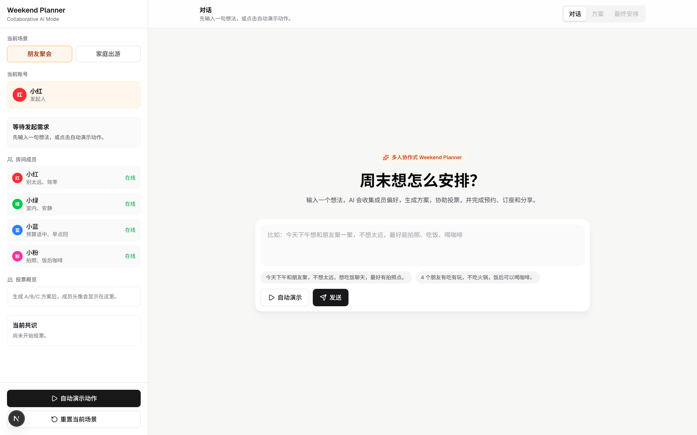
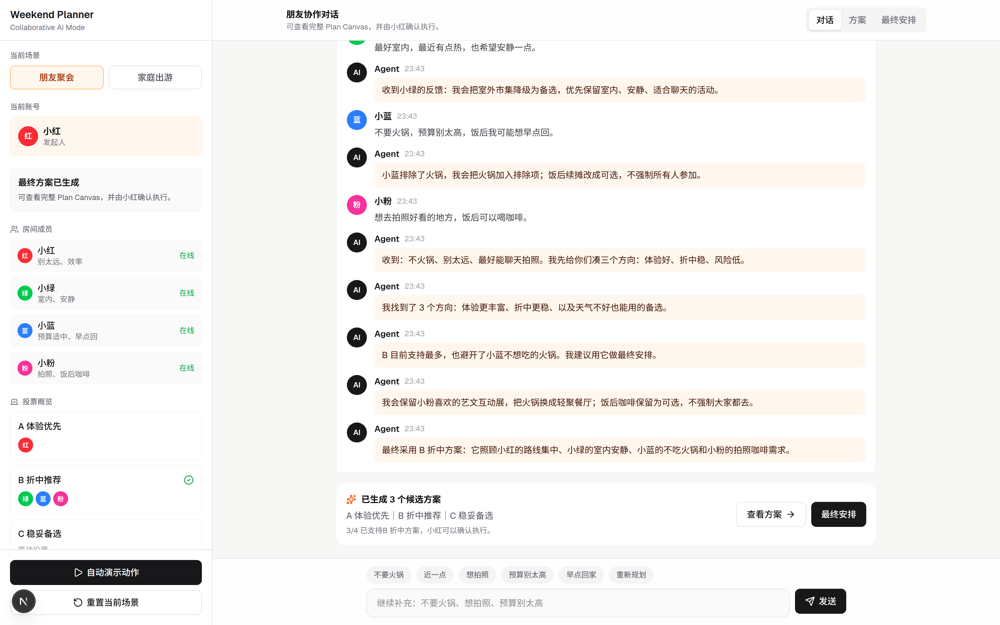
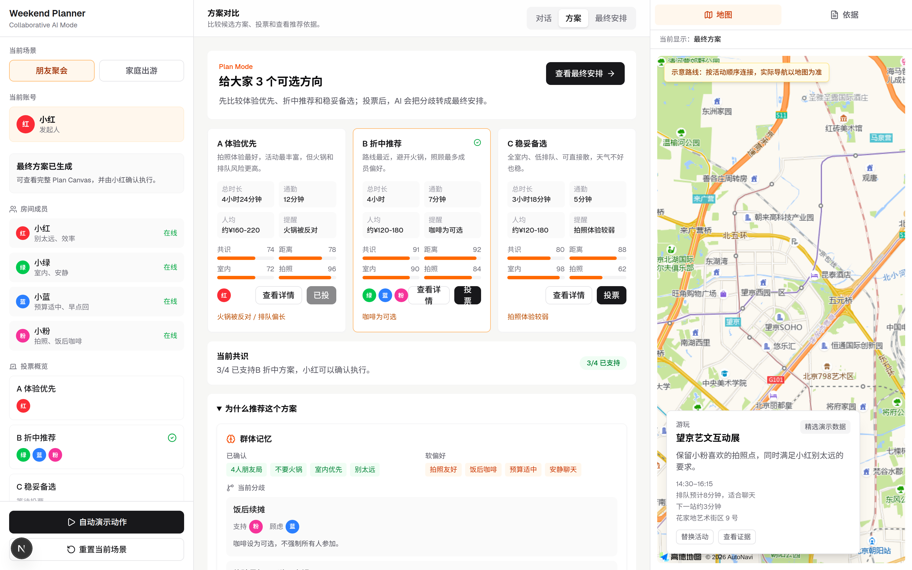
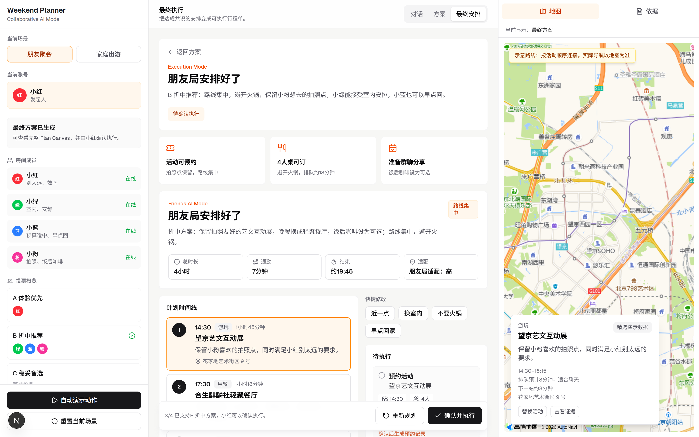
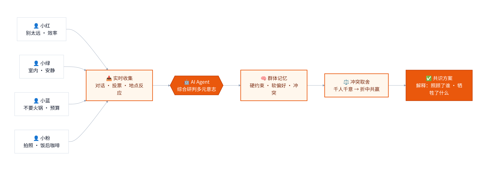
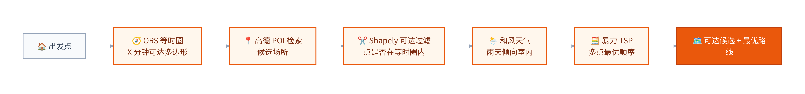
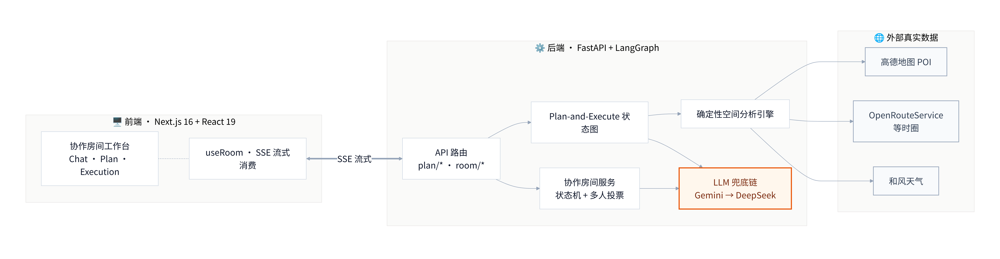
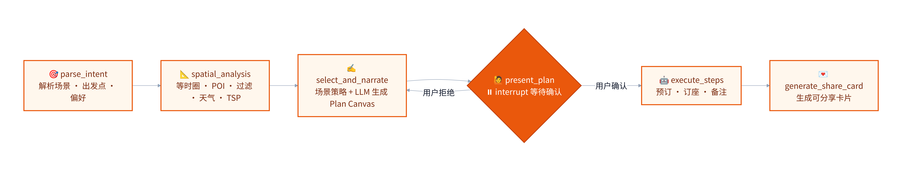

<div align="center"> 

# 🗺️ Weekend Planner · 周末活动规划 Agent

**美团 AI Hackathon 2026 参赛作品**

一个「人在回路」的周末出行规划智能体：你说需求，AI 结合**真实地理 / 天气 / POI 数据**生成可落地的活动方案，
在地图上可视化，并在你确认后自动完成「预订」。

LangGraph Plan-and-Execute · 确定性空间分析引擎 · Gemini 推理（DeepSeek fallback） · 高德地图可视化

</div>

---

## 🖼️ 界面预览

> 「朋友周末聚会」场景：从一句话发起 → 多人协作收偏好 → A/B/C 投票 → 生成可执行行程单。

<table>
  <tr>
    <td width="50%"><br/><sub><b>① 一句话发起</b> · 输入想法，或点「自动演示」让真实 LLM 驱动全程</sub></td>
    <td width="50%"><br/><sub><b>② 多人协作对话</b> · 成员补充偏好，Agent 边想边收敛群体约束</sub></td>
  </tr>
  <tr>
    <td width="50%"><br/><sub><b>③ A/B/C 方案对比</b> · 投票、共识、群体记忆 + 可达地图</sub></td>
    <td width="50%"><br/><sub><b>④ 最终行程单</b> · Plan Canvas 时间线 + 路线地图 + 一键执行</sub></td>
  </tr>
</table>

> 📄 **完整项目文档**（2 页 A4 PDF）：[**docs/项目文档.pdf**](docs/项目文档.pdf) — 人文内核 + 两大核心创新 + 系统设计图。

### 🧠 两大核心创新

<div align="center">
  
  <br/><sub><b>① 多人协同智能</b> · 多元意志 → 综合研判 → 群体记忆 → 冲突取舍 → 有解释的共识</sub>
</div>

<div align="center">
  
  <br/><sub><b>② GIS 深度融合</b> · 等时圈 → POI → 可达过滤 → 天气 → TSP → 最优路线</sub>
</div>

---

## ✨ 功能特性

- **🧭 Weekend Planner AI Mode**：面向家庭和朋友场景的本地生活计划与执行工作台。系统会将一句自然语言目标拆解为活动、餐饮、续摊、路线、可用性和执行动作多个子任务，结合真实地图工具、场景策略、演示业务接口和证据校验生成 Plan Canvas；用户可以继续反馈“近一点、换室内、不要火锅、早点回家”，系统会在当前计划上增量更新约束并重规划，确认后继续完成演示预约、订座、备注和分享。
- **👥 协作房间**：小红发起朋友聚会后，可邀请小绿、小蓝、小粉进入同一个 AI Mode 房间。产品体验分为 Chat / Plan / Execution 三层：先自然聊天收集偏好，再进入 A/B/C 方案投票和地点反应，最后生成可执行行程单；Agent 会把这些信号转成群体约束，推荐折中方案并解释照顾了谁、牺牲了什么。家庭出游也可切换为“小明 + 老婆确认 + 孩子画像约束”的协作流程。
- **🧠 意图理解**：自然语言描述需求（"周末带娃在望京附近玩半天，要有公园和好吃的"），自动解析场景、出发点、偏好。
- **📍 确定性空间分析**：不靠 LLM 拍脑袋，而是用真实数据计算可达范围与候选场所——
  - 基于 **OpenRouteService** 等时圈（isochrone）算出"X 分钟可达"的真实多边形；
  - 用 **高德地图 POI** 检索候选场所，**Shapely 点在多边形内**判定过滤；
  - **和风天气**接入，雨天自动倾向室内活动；
  - 暴力 **TSP** 求解多点最优游览顺序。
- **✍️ LLM 叙事编排**：Gemini（思考模式，DeepSeek 作为 fallback）从候选集中挑选并串成有温度的方案文案。
- **🙋 人在回路（Human-in-the-loop）**：方案先呈现给你审阅，**你点确认后**才进入执行，基于 LangGraph `interrupt` 实现。
- **🤖 自动执行**：确认后调用预订 / 库存 / 配送等工具完成闭环，并生成可分享卡片。
- **🗺️ 实时地图可视化**：高德地图实时绘制家的位置、等时圈、候选场所、最终路线与活动点。
- **⚡ SSE 流式体验**：规划全过程（思考 / 调用工具 / 出结果）通过 Server-Sent Events 实时推送到前端。

---

## 🏗️ 系统架构

<div align="center"></div>

> 「确定性工作流 + 可选 LLM 叙事层」：真实数据与状态由工程掌舵，LLM 只为体验添温度；单人规划走 LangGraph Plan-and-Execute，在 `present_plan` 处中断等待确认。

### 🧩 Agent 工作流（LangGraph 状态图）

<div align="center"></div>

---

## 🛠️ 技术栈

| 层 | 技术 |
|---|---|
| **后端框架** | FastAPI · Uvicorn · `sse-starlette`（SSE 流式） |
| **Agent 编排** | LangGraph 1.0（Plan-and-Execute + `interrupt` 人在回路） |
| **LLM** | Google Gemini · DeepSeek · 通义千问 Qwen · OpenAI（可插拔；默认 Gemini，fallback 优先级 Qwen → Gemini → DeepSeek → OpenAI，仅使用已配置 Key 的 provider；演示环境 Gemini 为主、DeepSeek 兜底） |
| **空间计算** | Shapely（点在多边形内）· 暴力 TSP 路径优化 |
| **外部数据** | 高德地图 POI · OpenRouteService 等时圈/路径 · 和风天气 |
| **日志 / 校验** | structlog · Pydantic v2 / pydantic-settings |
| **前端框架** | Next.js 16.2.6（Turbopack）· React 19 · TypeScript 5 |
| **样式 / 组件** | Tailwind CSS 4 · lucide-react |
| **地图** | 高德地图 JS API（`@uiw/react-amap` + 原生 loader） |
| **包管理** | 后端 `uv` · 前端 `pnpm`（Corepack 锁定 `packageManager`） |

---

## 📁 目录结构

```
.
├── backend/                    # FastAPI + LangGraph 后端
│   ├── app/
│   │   ├── main.py             # FastAPI 应用入口 / CORS
│   │   ├── config.py           # pydantic-settings（读取 .env）
│   │   ├── api/routes.py       # /api/health · plan/* · room/*
│   │   ├── agents/orchestrator.py   # LangGraph 状态图（核心编排）
│   │   ├── services/spatial.py      # 确定性空间分析引擎
│   │   ├── services/canvas.py       # PlanCanvasState adapter（用户唯一方案契约）
│   │   ├── services/feedback.py     # 二轮反馈约束更新
│   │   ├── services/room.py         # 协作房间内存状态与多人投票规则
│   │   ├── llm/                # provider 选择 / fallback / prompts
│   │   ├── tools/              # isochrone · poi_search · routing · weather · booking · availability · delivery
│   │   └── models/            # schemas · state · canvas · room · domain
│   ├── tests/
│   ├── pyproject.toml
│   └── .env.example           # ← 复制为 .env 填入真实 Key
│
├── frontend/                   # Next.js 16 前端
│   ├── app/page.tsx           # 三栏协作工作台（房间 / 对话 Canvas / 地图来源）
│   ├── components/            # room · canvas · evidence · chat · plan fallback · map · ui
│   ├── hooks/useRoom.ts       # 协作房间状态与动作
│   ├── hooks/useChat.ts       # 单人聊天状态机 + SSE 消费
│   ├── lib/api.ts             # plan SSE + room API
│   └── .env.example           # ← 复制为 .env.local 填入高德 JS Key
│
└── README.md
```

---

## 🚀 快速开始

### 前置要求

- **Python ≥ 3.11**（推荐 3.13）+ [`uv`](https://github.com/astral-sh/uv)
- **Node.js ≥ 20** + [`pnpm`](https://pnpm.io)（已用 `packageManager` 锁定，`corepack enable pnpm` 即可）
- 各外部服务的 API Key（见下方[环境变量](#环境变量)）

### 1. 克隆

```bash
git clone https://github.com/Epawse/weekend-planner.git
cd weekend-planner
```

### 2. 启动后端（:8000）

```bash
cd backend
uv venv --python 3.13 .venv
VIRTUAL_ENV=$(pwd)/.venv uv pip install -e ".[dev]"

cp .env.example .env        # 填入真实 API Key
.venv/bin/python -m uvicorn app.main:app --host 0.0.0.0 --port 8000
```

健康检查：`curl http://localhost:8000/api/health`

### 3. 启动前端（:3000）

```bash
cd frontend
pnpm install

cp .env.example .env.local  # 填入高德 JS API Key
pnpm dev
```

打开 <http://localhost:3000>。

### 环境变量

**`backend/.env`**（复制自 `backend/.env.example`）：

| 变量 | 说明 |
|---|---|
| `GEMINI_API_KEY` | Google Gemini（默认 / 主力 LLM，OpenAI 兼容端点） |
| `DEEPSEEK_API_KEY` | DeepSeek（fallback） |
| `DASHSCOPE_API_KEY` | 通义千问 Qwen（可选） |
| `OPENAI_API_KEY` | OpenAI（可选） |
| `AMAP_API_KEY` | 高德 **Web 服务** Key（POI 检索） |
| `ORS_API_KEY` | OpenRouteService（等时圈 / 路径） |
| `QWEATHER_API_KEY` | 和风天气 |
| `THINKING_ENABLED` / `THINKING_EFFORT` | 思考模式开关 / 强度 |
| `DEFAULT_LLM_PROVIDER` | 默认 LLM 提供方（默认 `gemini`） |

> LLM fallback 优先级为 **Qwen → Gemini → DeepSeek → OpenAI**，仅使用已配置 Key 的 provider。
> 思考模式：DeepSeek 走 `thinking` flag，Gemini 3.x 则映射到 `reasoning_effort`（且无法完全关闭，思考会占用 `max_tokens` 预算）。

**`frontend/.env.local`**（复制自 `frontend/.env.example`）：

| 变量 | 说明 |
|---|---|
| `NEXT_PUBLIC_API_BASE_URL` | 后端地址，默认 `http://localhost:8000` |
| `NEXT_PUBLIC_AMAP_KEY` | 高德 **JS API** Key（地图渲染，与后端 Web 服务 Key 不同） |

> ⚠️ 高德的 **JS API Key**（前端地图）和 **Web 服务 Key**（后端 POI）是两套不同的 Key，请分别申请。

---

## 🔌 API 接口

| 方法 | 路径 | 说明 |
|---|---|---|
| `GET` | `/api/health` | 健康检查 + 各 LLM provider 可用性 |
| `POST` | `/api/plan/create` | 启动规划，**SSE** 流式推送思考 / 工具 / 方案事件，到 `present_plan` 处中断等待确认 |
| `POST` | `/api/plan/approve` | 携带 `session_id` + `approved` 恢复图执行，**SSE** 流式推送执行进度 |
| `POST` | `/api/plan/feedback` | 对当前 Plan Canvas 增量应用“近一点 / 换室内 / 不要火锅 / 早点回家”等反馈 |
| `GET` | `/api/room/{room_id}` | 获取协作房间状态，支持 `?user=red/green/blue/pink/wife`；默认返回 idle 空房间 |
| `POST` | `/api/room/{room_id}/reset` | 重置协作房间，可带 `?scenario=friends/family` |
| `POST` | `/api/room/{room_id}/scenario` | 切换朋友 / 家庭协作场景并回到 idle |
| `POST` | `/api/room/{room_id}/advance` | 推进一个可见演示事件：发起、typing、成员消息、三方案、投票、共识、最终方案 |
| `POST` | `/api/room/{room_id}/advance/stream` | **SSE** 流式推送 Agent 可见推理（`reasoning` 增量），结束时下发完整房间状态 |
| `POST` | `/api/room/{room_id}/message` | 添加成员消息并更新群体记忆 |
| `POST` | `/api/room/{room_id}/message/stream` | **SSE** 先落用户消息，再流式推送 Agent 推理与回复；无 Key / 失败回退脚本回复 |
| `POST` | `/api/room/{room_id}/vote` | 添加方案级投票 |
| `POST` | `/api/room/{room_id}/reaction` | 添加地点级反应 |
| `POST` | `/api/room/{room_id}/simulate` | 一次性执行稳定协作演示脚本到最终方案态 |
| `POST` | `/api/room/{room_id}/execute` | 由发起人确认执行当前共识方案 |

SSE 事件类型：`session` · `thinking` · `tool_calling` · `tool_result` · `node_complete` · `plan_ready` · `interrupted` · `step_start` · `step_complete` · `all_complete` · `done` · `error`。

---

## 🧩 WSL2 / 跨平台说明

本项目可能在 macOS 与 Windows/WSL 之间迁移，已知注意事项：

- **跨平台依赖需重建**：从 macOS 拷贝来的 `backend/.venv`（含平台相关解释器）和 `frontend/node_modules`（含 `*-darwin-arm64` 原生包）在 Linux/WSL 上不可用，须按上面步骤**重新安装**。
- **WSL2 NAT 网络**：若 Windows 浏览器访问不到 WSL 内服务，前端需绑定 IPv4 通配地址，否则 `localhostForwarding` 不转发：
  ```bash
  pnpm dev -H 0.0.0.0
  ```
- **行尾 / 权限**：仓库使用 `core.autocrlf=input`；若 `git status` 出现大量「仅权限位（mode）变化」，执行 `git config core.fileMode false` 即可消除（已是跨平台搬运噪声，非真实改动）。
- `*:Zone.Identifier`（Windows 隔离标记）与 `.DS_Store`（macOS）已在 `.gitignore` 中忽略。

---

## 🧪 开发

```bash
# 后端
cd backend
.venv/bin/ruff check app          # Lint
.venv/bin/pytest                  # 测试

# 前端
cd frontend
pnpm lint
pnpm build
```

---

## 📄 License

本项目为美团 AI Hackathon 2026 参赛 Demo，仅供学习与演示。
